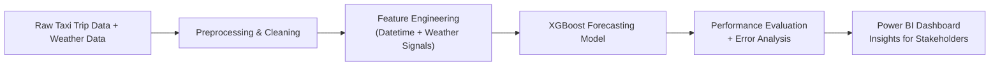

# 🚕 NYC Taxi Demand Forecasting + Weather Impact Analysis


*Short-term time-series forecasting for smarter mobility planning*

---

## 📌 Project Overview

NYC taxi demand varies significantly with:
- 🕒 Time-based patterns (rush hours, weekends)
- 🌡️ Weather conditions (temperature, humidity, rain)
- 🚦 Seasonal changes

This project builds a **7-day ahead hourly forecasting model** integrated with weather features to help:
- ✅ Improve taxi allocation
- ✅ Minimize passenger wait times
- ✅ Optimize pricing strategy

---

## ✨ Interactive Power BI Dashboard

(Forecasting Performance + Weather Impact Insights)

**📍 Actual vs Predicted Trips — Forecasting Dashboard**


**🌦️ How Weather Influences Taxi Demand**


---

## 🎯 Project Objectives
- ✔ Build a reliable short-term hourly forecast (7-day horizon)
- ✔ Quantify impact of temperature, humidity & rain
- ✔ Create a dashboard for business decision-makers

---

## 🧠 Key Insights
| Area              | Finding                                                    |
| ----------------- | ---------------------------------------------------------- |
| Temperature       | Higher temp → **more** taxi rides                          |
| Humidity          | Higher humidity → **lower** demand                         |
| Rain              | Minimal impact in winter (NYC riders rely on taxis anyway) |
| Time Patterns     | Strong peaks: **8–10 AM** & **5–8 PM**                     |
| Forecast Accuracy | ✅ Forecast is stable + low error                           |

📌 Average Forecast Error: 5.18 trips/hour
✅ Model performing well for January patterns

## 🧰 Tech Stack
| Category        | Tools Used                                |
| --------------- | ----------------------------------------- |
| Data            | NYC TLC Taxi Trip Data, NOAA Weather Data |
| Programming     | Python (Pandas, NumPy)                    |
| Forecasting     | XGBoost Regression                        |
| Visualization   | Power BI, Matplotlib                      |
| Version Control | Git + GitHub                              |

## 🔁 Workflow

---

## 📂 Repository Structure
```
ride-sharing-demand-forecasting/
│
├── Data/                               # All datasets used in the project
│   ├── raw/                            # Original source data
│   │   ├── NYC TLC Trip Record.csv
│   │   └── EWR.csv                     # Weather data (NOAA - Newark Airport)
│   │
│   ├── processed/                      # Cleaned & time-aligned datasets
│   │   ├── NYC_Taxi_Weather_Jan2023.csv
│   │   ├── nyc_hourly_demand.csv
│   │   └── nyc_hourly_weather.csv
│   │
│   ├── Merged/                         # Final ML-ready dataset
│   │   └── nyc_demand_weather_merged.csv
│   │
│   └── README.md
│
├── Notebooks/                          # Jupyter workflows
│   ├── Notebook_1_Data_Preprocessing_(Taxi_+_Weather).ipynb
│   ├── Notebook_02_EDA.ipynb
│   └── Notebook_03_Forecasting.ipynb
│
├── reports/                            # Final dashboards & results
│   ├── NYC Taxi Demand Forecast + Weather Analysis.pbix
│   └── NYC Taxi Demand Forecast + Weather Analysis.pdf
│
├── src/                                # (Optional future) Python scripts for ML pipeline
│
└── README.md                           # Documentation (You are here ✅)
```
---

## 📈 Forecasting Model Details

- Model: XGBoost Regressor
- Target: trip_count (hourly pickups)
- Features:
-- Temperature (tmpf)
-- Humidity (relh)
-- Rain probability (p01i)
-- Time-based features: hour, weekday, weekend, trends

## ⚙️ Setup & Usage (For Users)
To reproduce the forecasting results and Power BI insights:
1. Clone this repository
2. Run the notebooks in the following order:
* Notebook_1_Data_Preprocessing_(Taxi_+_Weather).ipynb
* Notebook_02_EDA.ipynb
* Notebook_03_Forecasting.ipynb
3. View insights through:
* 📈 NYC Taxi Demand Forecast + Weather Analysis.pbix (interactive dashboard)
* 📄 NYC Taxi Demand Forecast + Weather Analysis.pdf (static export)
Processed and merged datasets are included in /Data/processed/ and /Data/Merged/.

## ✅ Performance:
- 📉 RMSE: ~5.18 trips/hour
- 🔍 Robust even during weekends

## 📌 Business Value
| Impact Area         | Value Delivered                    |
| ------------------- | ---------------------------------- |
| Fleet Mgmt.         | Better shift scheduling & coverage |
| Pricing             | Smarter surge pricing strategies   |
| Customer Experience | Reduced wait-time complaints       |
| Operations Cost     | Lower idle fleet cost              |

---

## 🚀 Next Steps
- ✅ Full year forecasting (seasonality-aware)
- ✅ Add holiday + event features
- ✅ Deploy live dashboard with real-time API
- ✅ Multi-model comparison: Prophet, LSTM, ARIMA

---

## 📬 Connect With Me
If you found this project interesting — let’s connect 👇
- LinkedIn: https://www.linkedin.com/in/advait-chavadekar/
- GitHub: https://github.com/crazyandiee

---

# ⭐ If you like this project, please star the repository to support!


